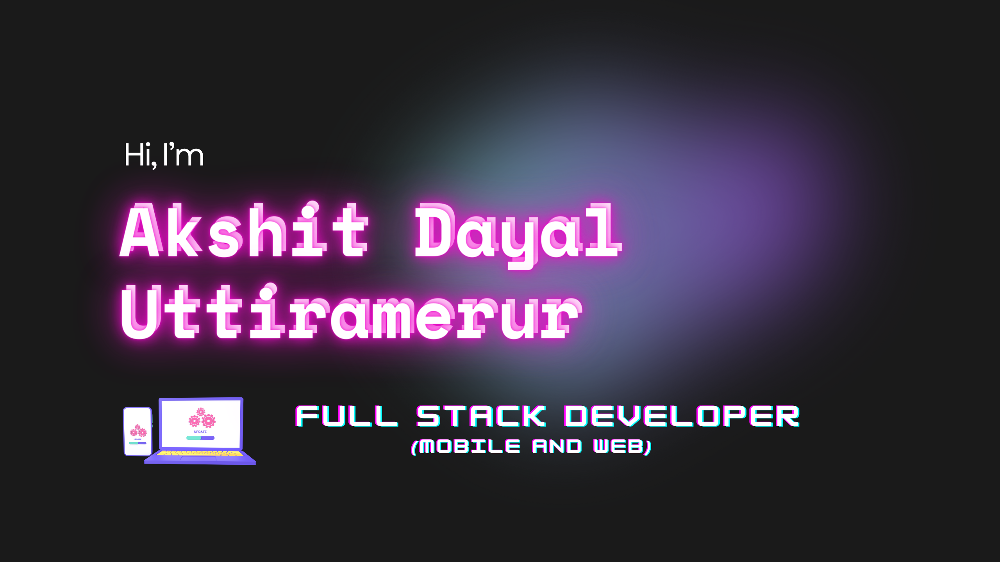

<h1 align="center">🐺 Hi, I’m Akshit Dayal </h1>

 <strong>🖥️ Full-Stack Developer</strong> 

<h3>🤝 Connect with me:</h3>

<a href="https://medium.com/@akshitdayal99/" target="_blank">
<!--    -->
  My Medium
</a>
 
<a href="https://akrypt.github.io" target="_blank">
  My Website
</a>

- 👀 I’m currently interested and looking for a Software Developer role.

- 📫 How to reach me: LinkedIn: https://www.linkedin.com/in/akshit-u/ 

  I'm a Software Engineer with MS in CS at NJIT.
  Currently looking and actively applying for full-time roles and would really appreciate any leads.
  I'm a motivated self-learner who strives to be fast and efficient.
  My motive is to make things easier and efficient for people through technology and eliminate the use of paper.

Misc.:
I can speak Japanese and am a dancer.
