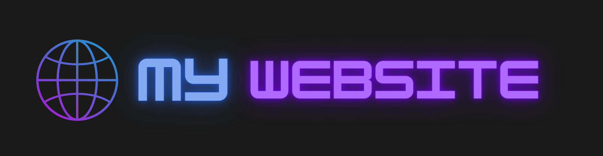

<h1 align="center">🐺 Hi, I’m Akshit Dayal </h1>

 <strong>🖥️ Full-Stack Developer</strong> 

  I'm a passionate technology enthusiast with a Master's degree in CS from NJIT.
  I have worked at multiple startups which enabled me to be highly adaptable and 
  quick at learning new tools and technologies. I am currently learning and exploring
  the field of Natural Languagee Processing [NLP].
  My motive is to build things that make this world a more convenient place for humans.

 

## 🤝 Connect with me:

 

 

📥 <a href="mailto:akshitdayal99@gmail.com" target="_blank">akshitdayal99@gmail.com</a>

 

## 💻 Tools and Technologies

      
 

  

## 📊 Stats
 
 

 

## ⚽ Interests & Hobbies
I love Dancing 💃, Video Games 🎮 and I can speak Japanese 🍙
